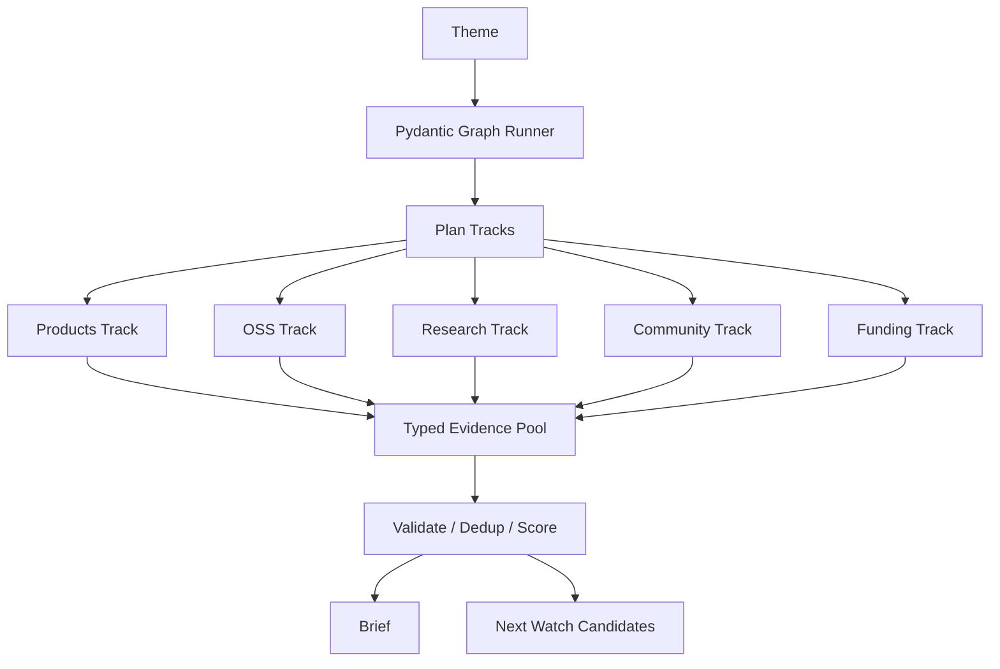

# SignalGraph Specification

## Goal

SignalGraph monitors overseas weak signals and produces a structured brief that
explains which signals may matter for Japan-facing business opportunities.

## Flow

## Codex SDK

SignalGraph opens one `AsyncCodex` session and starts read-only ephemeral
threads per research track. Each thread receives a strict JSON schema and returns
a `TrackResearchResult`.

The runtime uses the user's configured Codex authentication. SignalGraph does not
read Codex auth files or manage API keys.

## Output Contract

The top-level result is `TrendBrief`:

- `theme`
- `language`
- `summary`
- `signals`
- `committed_signals`
- `quarantined_signals`
- `rejected_signals`
- `next_watch_candidates`

The current implementation does not persist state. Future work should add a
state store for historical diffing, quarantine rechecks, and watchlist growth.
